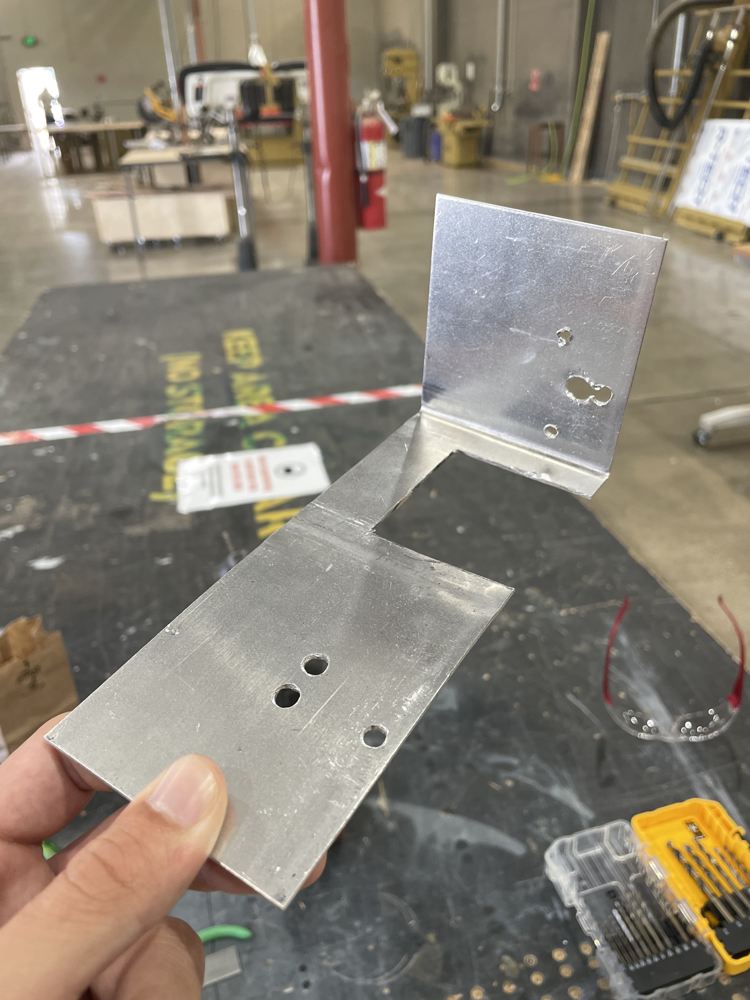
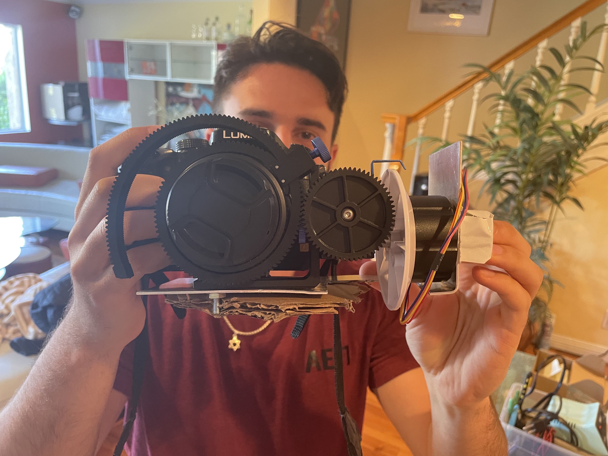
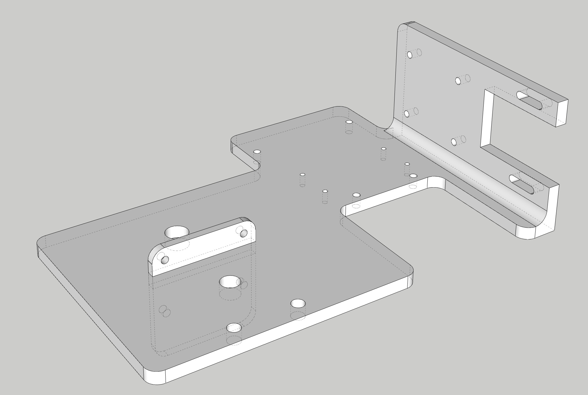
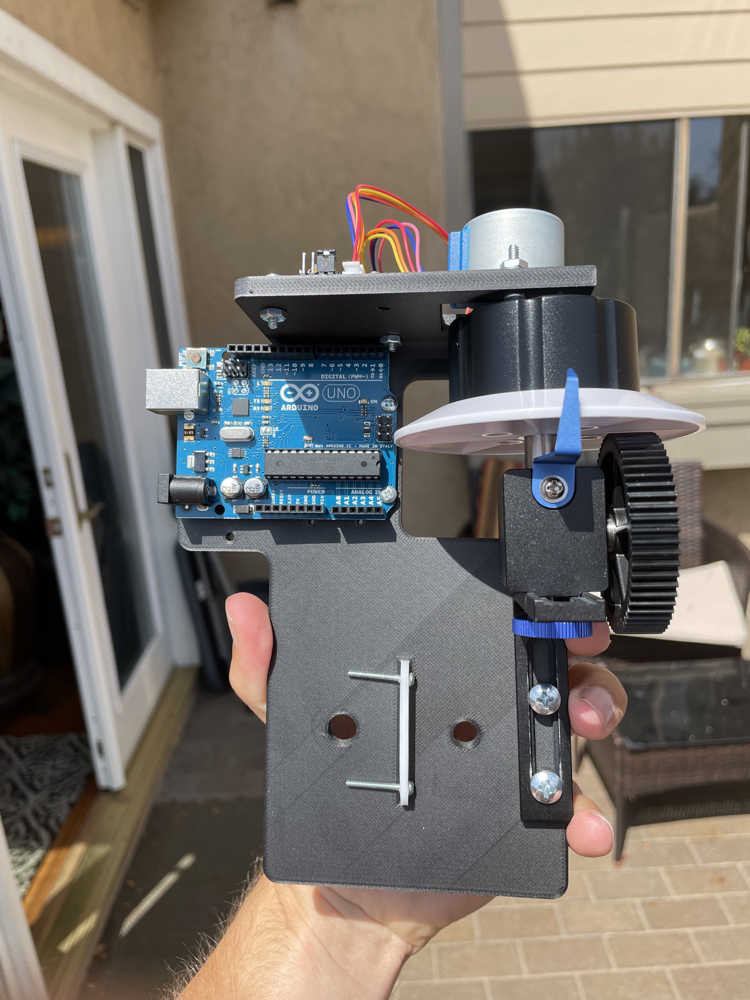
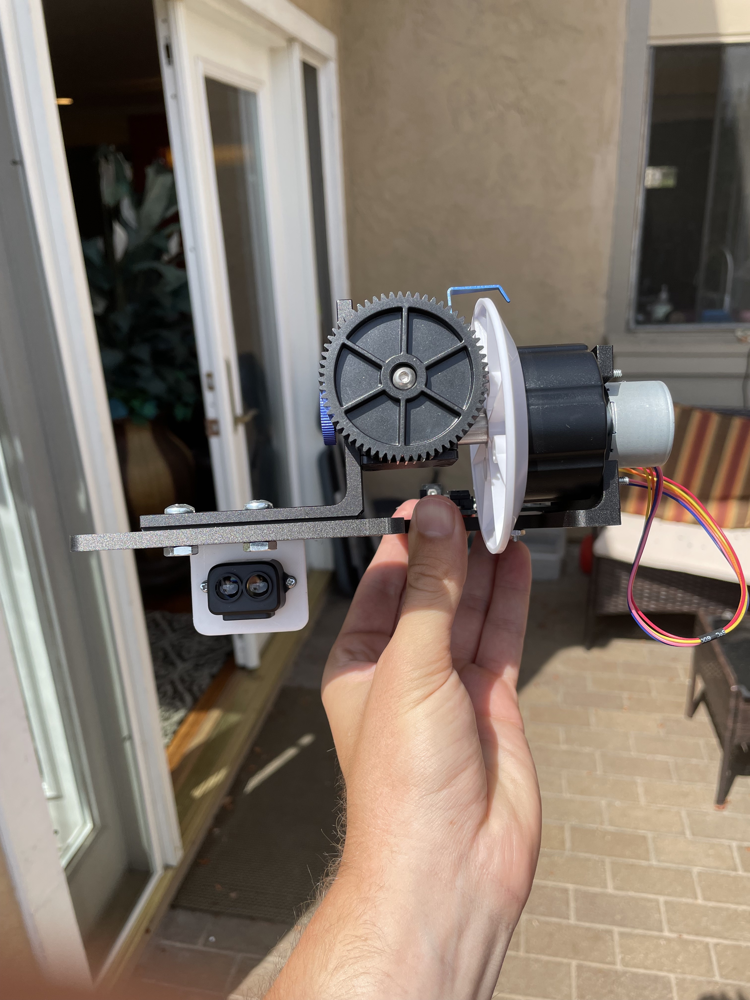
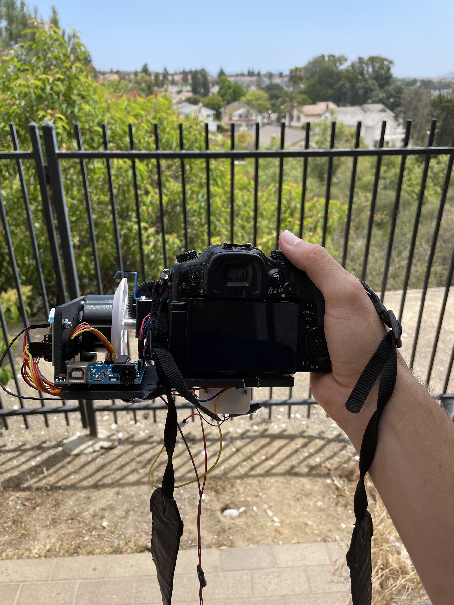
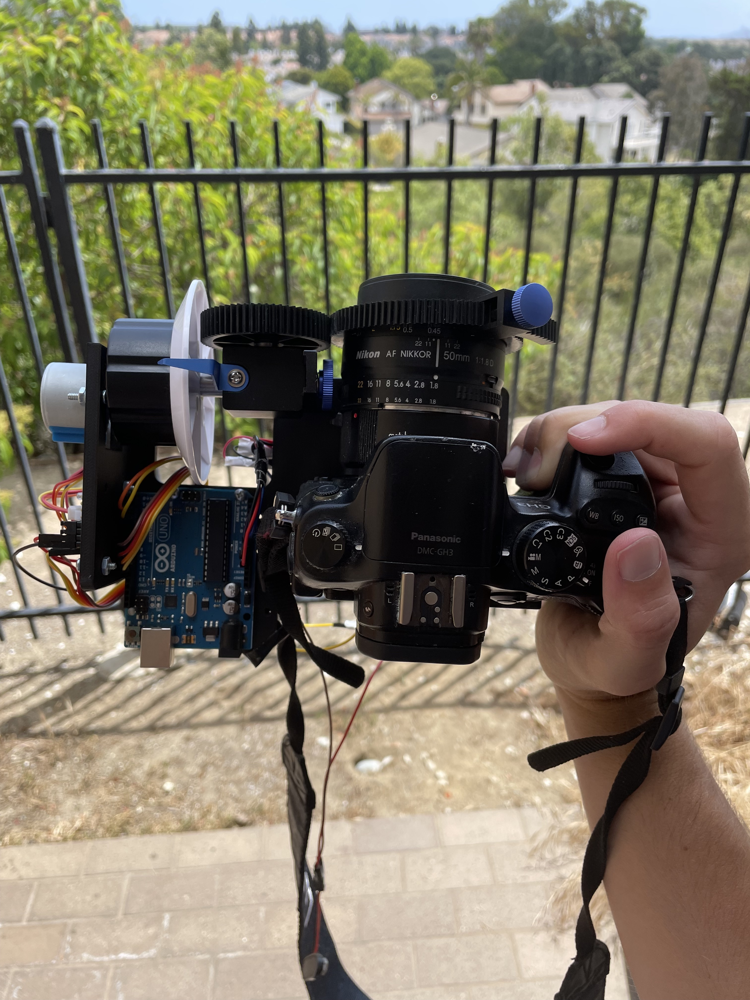
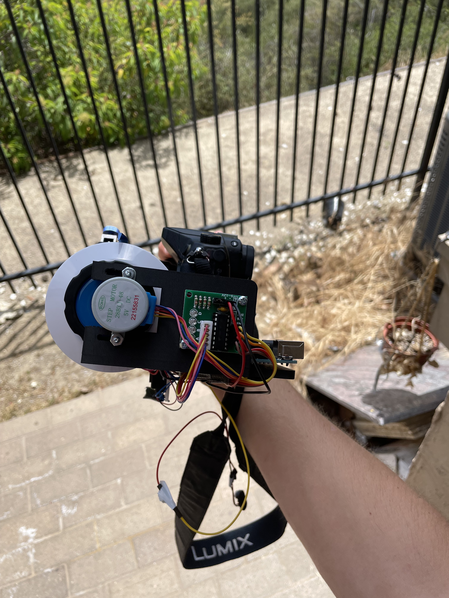
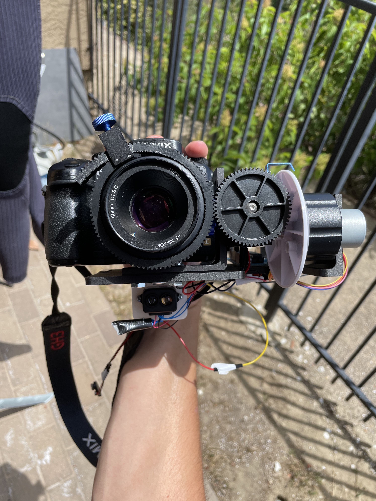

# AutomaticFollowFocus

## Team
#### Dayyan Sisson - Software Lead
#### Ethan Lerner - Hardware Lead
#### Gabriel Beal - Software/Hardware Tech

## Overview

### Motivation
Professional-grade consumer cameras are used by more and more cinematographers for a variety of projects, ranging from amateur shoots, to mid-size productions. While these cameras are developing better digital autofocus, these systems only work with compatible lenses. Since most cinematographers in this demographic use a variety of lenses, reliable digital autofocus is rarely an option. Manual focusing requires skill and experience in order to maintain focus in a scene. A follow focus is a device which allows for more precise control of focus, but still requires highly skilled operators (which often necessitates a second operator) while capturing a scene.

### Our solution
Our solution is an automatic follow focus system. It would operate much like an industry standard manual follow focus system, but would automatically keep a target subject in focus  without the need of human intervention. The automatic follow focus, after minimal calibration, would give camera operators a smooth, reliable, and precise focusing mechanism, that would remove the need for highly skilled focus operators, reduce the amount of thrown away takes, and shorten the scene planning process.

### Approach
To create an automatic follow-focus, our system will need to be broken down into three main components: the follow-focus-rig, the depth-sensor, and the computer. The follow-focus rig would provide the mechanism for focusing a manual camera lens, and will follow the same structure and components of industry standard manual follow-focuses. Ideally, our system could be attached to existing follow-focuses. This component also includes the motor components needed to automatically drive the follow-focus. The depth-sensor would provide the data needed to determine how far and/or where the subject of the shot is to be able to determine focus. The computer would do the necessary calculations to control the follow-focus motor after reading in the depth-sensor data.

For our MVP, we will adapt an existing manual follow-focus rig with a small, fine-grained, and silent stepper-motor to control focus. The depth-sensor will be a LiDar time-of-flight sensor to determine distance, and an Arduino UNO as the computer. Once attached and calibrated to the lens, the focus will dynamically adjust so that whatever is at the center of the frame always remains in focus up to a range of 8m. 

### Media

#### Original Mount

This mount was made using a flat piece of steel which we bent and removed sections using a dremel. This was to give us a basic idea of what we were going to model.

#### Original System

This is the original mount attached to the camera with some of the system components attached (stepper motor). 

#### 3D Models and Iterations

This is the 3D model we designed based on the original mount. We included mounting points for all of the systems hardware components. This took several iterations to get the mounting locations in the ideal placements.

Final Iteration: Carbon Fiber mount with attached hardware

#### Complete System

Here is our complete system wired up and running. The wires are a bit messy and given more time we have several changes that we would like to implement but this system achieves our base goals.

## Repo Organization
### Images
This folder contains all the images needed for the README

### Code
This folder contains our audino file that controls the system

## Relevant Files
[Project Specification](https://docs.google.com/document/u/1/d/e/2PACX-1vR7f_SCI-wuG92Et0VP4YWmQdNeJKLPD-W7jhbWiDdFht9IB5lYc-DVYsRZljCv2UFADpbiVSlDBm2-/pub)

[Milestone Report](https://docs.google.com/document/d/e/2PACX-1vRDqsqV7q2qU70tZm42NWyuAJPylhJETKva-iidkfWNiynRTFDRNkfxW0TCXdBWoWRqfZBtMWYlbz5G/pub)

[Oral Update](https://docs.google.com/presentation/d/e/2PACX-1vSpkfmF8wC4bcpIy2F_BTrdK_YAkHR9gESRvpczLLuf5MXxQVo-R_bJhY_RxzTn6OQB8V0ov08AnhvS/pub?start=false&loop=false&delayms=3000)

[Final Oral Update](https://docs.google.com/presentation/d/e/2PACX-1vTmCl1PBQolEVxEH3D6TQDxceaFYIcq-r6SjPEK2jjG0rSF97mehDbIC0gli58A3UxafzSPnDdnN2j6/pub?start=false&loop=false&delayms=3000)

